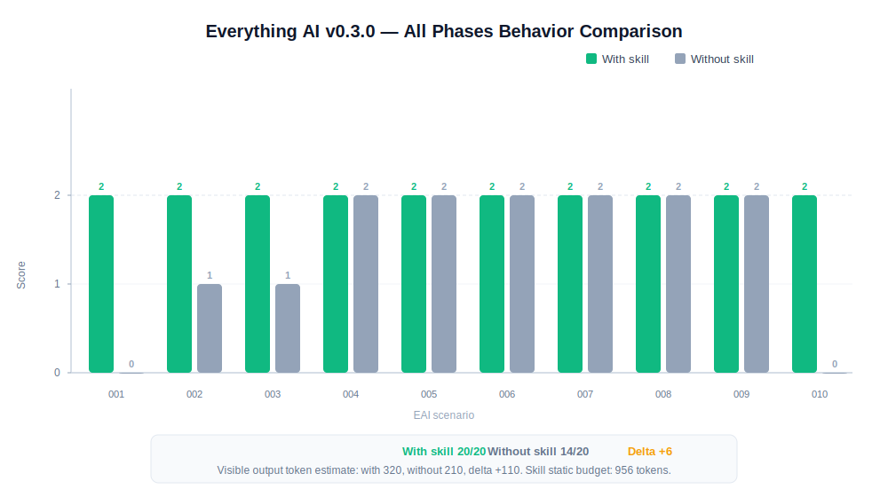

# Everything AI

[](https://github.com/mitunmanav/everything-ai/actions/workflows/test.yml)

Everything AI is an agent skill for people who ask AI to handle the whole task.

It is built for non-technical users, vibe coders, and broad requests like:

- `do everything`
- `handle it end-to-end`
- `audit everything`
- `set up the whole thing`
- `whatever is needed`

Most agents ask expert questions too early. Everything AI tells the agent to infer scope, choose safe defaults, act where safe, and ask only real blocker questions.

## What It Does

When triggered, the skill pushes the agent to:

- infer the missing expert checklist
- start with safe defaults
- avoid dumping expert choices on the user
- stop before paid, destructive, private, medical, legal, or unsafe actions
- show what was checked, assumed, missed, and still unknown
- write reviewable trace fields when memory or observability is useful

Short version:

> User gives goal. AI carries expert scope.

## Install

Default (Codex/OpenAI):

```powershell
npx --yes github:mitunmanav/everything-ai
```

Dry run:

```powershell
npx --yes github:mitunmanav/everything-ai -- --dry-run
```

Claude:

```powershell
npx --yes github:mitunmanav/everything-ai -- --agent claude
```

Use after install:

```txt
Use $everything-ai and do everything for this task.
```

The installer copies only `skills/everything-ai`, sends no telemetry, reads no secrets, and refuses overwrite unless `--force` is used.

Default install target is Codex/OpenAI. Use `--agent claude` for Claude.

## v0.3.0 Status

Proof release: all 5 phases complete. 19/19 tests green.

| Metric | Result |
|---|---|
| Behavior | with skill 20/20 · without 14/20 · delta +6 |
| Eval | 100/100, Grade A, low risk |
| Model | gpt-5.5, medium reasoning |



Details: [TEST_RESULTS.md](TEST_RESULTS.md) · [EVALUATION.md](EVALUATION.md) · [ROADMAP.md](ROADMAP.md)

## Domain Packs

Domain packs live in `skills/everything-ai/domains/`.

Each pack must use this format:

- `## Scope Defaults`
- `## Checklist`
- `## Pitfalls`
- `## Success Looks Like`
- `## Examples` with `Example 1` and `Example 2`

Current packs:

- `startup.md`
- `data-analysis.md`
- `personal-productivity.md`

Saved domain-pack comparison: [`tests/results/v0.3.0-domain-pack-comparison.json`](tests/results/v0.3.0-domain-pack-comparison.json)

## Privacy

v0.3.0 public files must not include local paths, local machine names, emails, tokens, secrets, private thread IDs, or private user details.

Project tests scan public docs for local-only path and identity leaks.

## Star History

[](https://www.star-history.com/#mitunmanav/everything-ai&Date)
