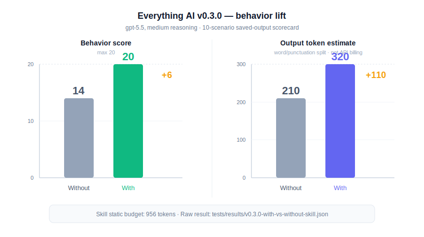

# Everything AI

Everything AI is a Codex skill for people who ask AI to handle the whole task.

It is built for non-technical users, vibe coders, and broad requests like:

- `do everything`
- `handle it end-to-end`
- `audit everything`
- `set up the whole thing`
- `whatever is needed`

Most agents ask expert questions too early. Everything AI tells the agent to infer scope, choose safe defaults, act where safe, and ask only real blocker questions.

## What It Does

When triggered, the skill pushes the agent to:

- infer the missing expert checklist
- start with safe defaults
- avoid dumping expert choices on the user
- stop before paid, destructive, private, medical, legal, or unsafe actions
- show what was checked, assumed, missed, and still unknown
- write reviewable trace fields when memory or observability is useful

Short version:

> User gives goal. AI carries expert scope.

## Install

```powershell
npx --yes github:mitunmanav/everything-ai
```

Dry run:

```powershell
npx --yes github:mitunmanav/everything-ai -- --dry-run
```

Use after install:

```txt
Use $everything-ai and do everything for this task.
```

The installer copies only `skills/everything-ai`, sends no telemetry, reads no secrets, and refuses overwrite unless `--force` is used.

## v0.3.0 Status

v0.3.0 is a proof release draft. It is useful, but not final.

- local tests: passed
- skill validation: passed
- plugin evaluation: 100/100, Grade A, low risk
- behavior comparison: with skill 20/20, without skill 14/20, delta +6
- model: `gpt-5.4-mini`, medium reasoning
- test method: fresh subagent manual scorecard
- raw result: [`tests/results/v0.3.0-with-vs-without-skill.json`](tests/results/v0.3.0-with-vs-without-skill.json)



Known gaps:

- no real usage logs yet
- no coverage artifact yet
- benchmark is manual-scored, not an automated runner yet
- public GitHub release is still v0.2.0 until explicit approval

More detail: [`TEST_RESULTS.md`](TEST_RESULTS.md), [`EVALUATION.md`](EVALUATION.md), [`ROADMAP.md`](ROADMAP.md).

## Privacy

v0.3.0 public files must not include local paths, local machine names, emails, tokens, secrets, private thread IDs, or private user details.

Project tests scan public docs for local-only path and identity leaks.

## Star History

[](https://www.star-history.com/#mitunmanav/everything-ai&Date)
