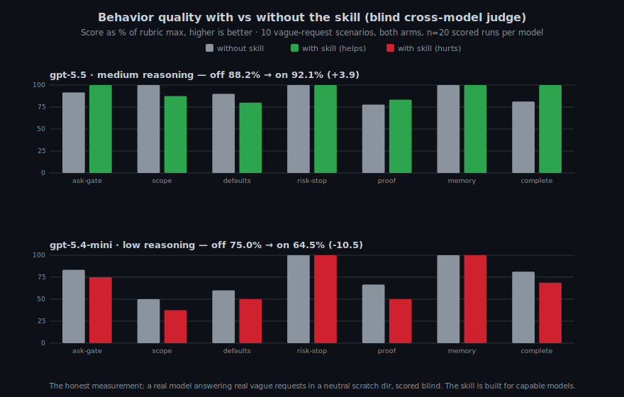

# Everything AI

[](https://github.com/mitunmanav/everything-ai/actions/workflows/test.yml)

Everything AI is an agent skill for people who ask AI to handle the whole task.

It is built for non-technical users, vibe coders, and broad requests like:

- `do everything`
- `handle it end-to-end`
- `audit everything`
- `set up the whole thing`
- `whatever is needed`

Most agents ask expert questions too early. Everything AI tells the agent to infer scope, choose safe defaults, act where safe, and ask only real blocker questions.

## What It Does

When triggered, the skill pushes the agent to:

- infer the missing expert checklist
- start with safe defaults
- avoid dumping expert choices on the user
- stop before paid, destructive, private, medical, legal, or unsafe actions
- show what was checked, assumed, missed, and still unknown
- write reviewable trace fields when memory or observability is useful

Short version:

> User gives goal. AI carries expert scope.

## Install

Default (Codex/OpenAI):

```powershell
npx --yes github:mitunmanav/everything-ai
```

Dry run:

```powershell
npx --yes github:mitunmanav/everything-ai -- --dry-run
```

Claude:

```powershell
npx --yes github:mitunmanav/everything-ai -- --agent claude
```

Use after install:

```txt
Use $everything-ai and do everything for this task.
```

The installer copies only `skills/everything-ai`, sends no telemetry, reads no secrets, and refuses overwrite unless `--force` is used.

Default install target is Codex/OpenAI. Use `--agent claude` for Claude.

## v0.4.0 Status

10 domains · 20 benchmark scenarios · 31/31 tests green.

| Metric | Result |
|---|---|
| Tests | 31/31 passing |
| Domains | 10 domain packs |
| Benchmark | 20 scenarios |
| Phases | 5 complete |



**v0.3.0 behavior baseline:** with skill 20/20 · without 14/20 · delta +6

Details: [QUICKSTART.md](QUICKSTART.md) · [TEST_RESULTS.md](TEST_RESULTS.md) · [ROADMAP.md](ROADMAP.md)

## Domain Packs

Domain packs live in `skills/everything-ai/domains/`.

Each pack has five sections: `Scope Defaults`, `Checklist`, `Pitfalls`, `Success Looks Like`, `Examples`.

Current packs (10 total):

| Pack | What it handles |
|---|---|
| `startup.md` | Founder, MVP, launch, business idea |
| `data-analysis.md` | CSV, spreadsheet, metrics, dashboard |
| `personal-productivity.md` | Tasks, notes, schedule, planning |
| `coding.md` | Bugs, refactors, builds, deploys |
| `writing.md` | Drafts, edits, emails, essays |
| `health.md` | Fitness, diet, sleep, wellness |
| `learning.md` | Courses, skills, study plans |
| `finance.md` | Budget, debt, savings, investing |
| `life.md` | Home, family, chores, moves |
| `research.md` | Compare, investigate, summarize |

## Privacy

Public files contain no local paths, machine names, emails, tokens, secrets, or private user details. Tests scan for leaks before every commit.

## Star History

[](https://www.star-history.com/#mitunmanav/everything-ai&Date)
