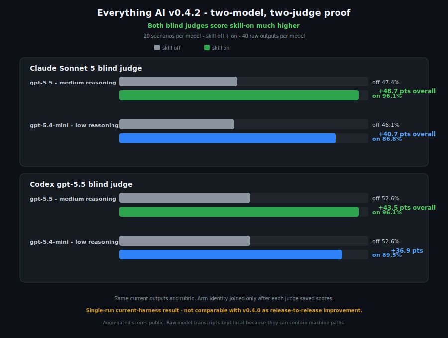

# Everything AI

[](https://github.com/mitunmanav/everything-ai/actions/workflows/test.yml)
[](https://github.com/mitunmanav/everything-ai/actions/workflows/codeql.yml)
[](https://github.com/mitunmanav/everything-ai/actions/workflows/scorecard.yml)

Everything AI is an agent skill for people who want AI to do everything.

> User gives goal. AI carries expert scope.

You say `do everything`, `handle it end-to-end`, or `whatever is needed`. The promise: the AI figures out the expert checklist, chooses safe defaults, starts useful work, and reports proof.

There is no mode menu and no expert questionnaire. Questions appear only when a real blocker or risky action needs you.

## What It Does

- Infers missing scope.
- Uses safe, reversible defaults.
- Works before asking non-blocking questions.
- Stops before paid, destructive, private, or high-stakes actions.
- Reports checked, changed, missing, unknown, and confidence.
- Supports 10 domain packs: coding, startup, research, finance, health, learning, writing, data, life, and productivity.

## Install

```powershell
npx --yes github:mitunmanav/everything-ai
```

Check first without installing:

```powershell
npx --yes github:mitunmanav/everything-ai -- --dry-run
```

Then ask:

```text
Use $everything-ai and do everything for this task.
```

The installer copies only the skill, sends no telemetry, reads no secrets, and refuses to overwrite an existing install unless you use `--force`.

More install options: [QUICKSTART.md](QUICKSTART.md).

## Proof

v0.4.2 full Codex blind judge: `gpt-5.5`, medium reasoning, 20 scenarios, both arms, 40/40 raw outputs.

- skill off 52.6% (40/76)
- skill on 96.1% (73/76)
- delta **+43.5 points**

<p align="center"></p>

Known skill-on partials: paid-tool proof trace (`EAI-005`) and architecture scope map (`EAI-007`). This Codex result is extra evidence. Historical comparison method stays unchanged.

Full method, older results, raw score files, and caveats: [TEST_RESULTS.md](TEST_RESULTS.md) and [EVALUATION.md](EVALUATION.md).

## Safety

Everything AI promises a process, not impossible outcomes.

- No destructive, paid, irreversible, or high-stakes action without approval.
- No secrets, local paths, raw private transcripts, or development rules in the public package.
- Pull requests must pass tests and CodeQL.
- GitHub releases stay manual.

## Improve It

Real failed prompts make the skill better:

1. Open an issue with the prompt and what went wrong.
2. Add it to the [prompt bank](skills/everything-ai/references/prompt-bank.md).
3. Turn it into a test, benchmark case, or domain example.
4. Fix the narrow behavior and show proof.

Contribution guide: [CONTRIBUTING.md](CONTRIBUTING.md).

## Details

- [Quick start](QUICKSTART.md)
- [Test results](TEST_RESULTS.md)
- [Evaluation method](EVALUATION.md)
- [Roadmap](ROADMAP.md)
- [Security](SECURITY.md)
- [Release checklist](RELEASE_CHECKLIST.md)

MIT licensed. Built and maintained by [Mitun Manav](https://github.com/mitunmanav).
