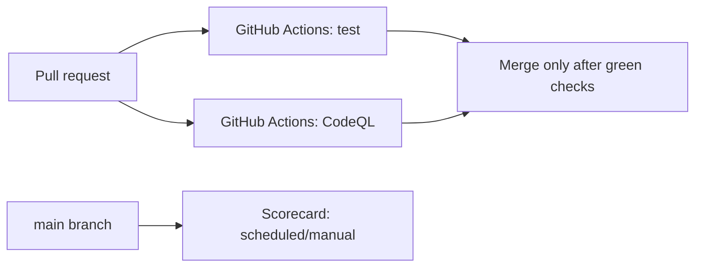
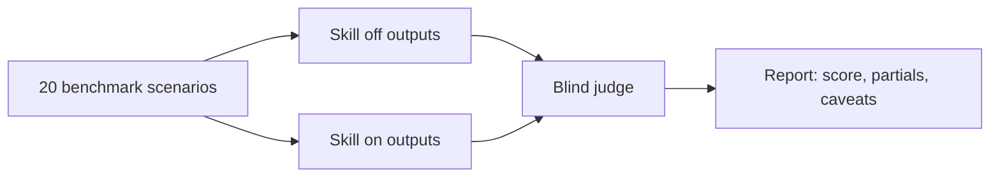

# Everything AI

[](https://github.com/mitunmanav/everything-ai/actions/workflows/test.yml)
[](https://github.com/mitunmanav/everything-ai/actions/workflows/codeql.yml)
[](https://github.com/mitunmanav/everything-ai/actions/workflows/scorecard.yml)

Everything AI is an agent skill for people who want AI to do everything.

The promise is simple: the user gives the goal; the AI figures out the expert checklist, gets to work, and reports proof.

It is built for non-technical users, vibe coders, and broad requests like:

- `do everything`
- `handle it end-to-end`
- `audit everything`
- `set up the whole thing`
- `whatever is needed`

Most agents ask expert questions too early. Everything AI tells the agent to infer scope, choose safe defaults, act where safe, and ask only real blocker questions.

It is also useful for experts who want delegation instead of babysitting. Experts can still review the proof report, but the agent carries the process.

## What It Does

When triggered, the skill pushes the agent to:

- infer the missing expert checklist
- start with safe defaults
- avoid dumping expert choices on the user
- stop before paid, destructive, private, medical, legal, or unsafe actions
- show what was checked, assumed, missed, and still unknown
- write reviewable trace fields when memory or observability is useful

Short version:

> User gives goal. AI carries expert scope.

## Guarantee

Everything AI does not promise impossible outcomes. It promises the process that gets better outcomes:

- no "what do you mean by everything?" stall
- no expert setup questionnaire before action
- no mode menu for the user to manage
- no destructive, paid, irreversible, or high-stakes action without approval
- clear proof of what was checked, done, assumed, blocked, and still unknown

## Community

The best improvements are real "do everything" prompts that failed or felt painful. Add them to `skills/everything-ai/references/prompt-bank.md`, then turn every accepted prompt into a benchmark scenario or domain example so the next user gets a better result.

## Install

Default (Codex/OpenAI):

```powershell
npx --yes github:mitunmanav/everything-ai
```

Dry run:

```powershell
npx --yes github:mitunmanav/everything-ai -- --dry-run
```

Claude:

```powershell
npx --yes github:mitunmanav/everything-ai -- --agent claude
```

Use after install:

```txt
Use $everything-ai and do everything for this task.
```

The installer copies only `skills/everything-ai`, sends no telemetry, reads no secrets, and refuses overwrite unless `--force` is used.

Default install target is Codex/OpenAI. Use `--agent claude` for Claude.

## v0.4.2 Status

10 domains / 20 benchmark scenarios / 60/60 unit tests green / v0.4.2 targeted fixes: launch proof, repo/product shipping, repo-scope inference, business-ops routing, research/buying safety, architecture default, contradiction read-only trace, empty-evidence no-stall trace, paid-action useful prework, destructive-action proof trace, community prompt lanes, high-stakes proof, empty-evidence scope boundary, and architecture proof shape / v0.4.1 live retest confirmed gpt-5.4-mini recovery / gpt-5.5 baseline unchanged at +3.9 pts.

v0.4.2 targets gaps found in the v0.4.0 live run: launch prompts could lose proof detail; repo requests needed stronger default audit scope; broad architecture prompts could turn into debate; contradictory requests could ask or lose trace shape; empty workspaces could stop with no scope, coverage, confidence, or next action; paid and high-stakes requests could lose proof detail. The skill now tells Codex and Claude to show launch assumptions and first safe action, inspect repo context before asking, choose SQL by default for ordinary app data, use read-only diagnosis for fix/change-nothing conflicts, return audit traces for missing evidence, compare paid options without buying, and keep emergency guidance first with proof. Targeted WSL reruns captured behavior for those gaps. The full v0.4.2 Codex judge below is extra proof, not a replacement for the original Claude judge method.

## Numbers

**v0.4.0 live-run (gpt-5.5) + v0.4.1 retest (gpt-5.4-mini).** v0.4.2 uses those results as the baseline and adds targeted local guards for empty-evidence stalls, paid-action partial stops, and high-stakes proof gaps. gpt-5.5 numbers are from the v0.4.0 run; not re-run in v0.4.1. gpt-5.4-mini was retested (n=40) after the PLUGIN_DATA patch and recovered to +2.6 pts overall. First retest run failed transiently; second run produced the confirmed result.

The unbiased full benchmark method stays the v0.4.0 method. Targeted v0.4.2 tests only find and verify narrow fixes before a full rerun; they do not replace the benchmark score.


The measurement: a real model doing real work — `gpt-5.5` (and `gpt-5.4-mini`) answering the benchmark's vague "do everything" prompts with and without the skill, scored by a **blind cross-model judge** (Claude, never told which arm produced which output). Ten scenarios, both arms — n=20 scored runs per model.

v0.4.2 full Codex blind judge: `gpt-5.5` medium reasoning, 20 scenarios, both arms, 40/40 raw outputs. Codex judged blind before arm key join: skill off 52.6%, skill on 96.1%, delta **+43.5 points**. Known skill-on partials: `EAI-005` paid-tool proof trace and `EAI-007` architecture scope map. Claude judge is still not available in this local environment.

## Automation Flow



Scorecard is not a pull-request gate. It runs on schedule or manually, then uploads SARIF when GitHub allows it.

## Proof Flow



The v0.4.2 Codex judge is extra evidence. The older Claude-judge method stays the official historical comparison.

<p align="center"></p>

Score as % of the rubric max (higher is better), per arm — **gpt-5.5 from v0.4.0 run · gpt-5.4-mini v0.4.0 bugged row + v0.4.1 fixed row**. **Bold** marks the winning arm; `Δ` is the with-skill change in points.

| arm | overall | ask-gate | scope | defaults | risk-stop | proof | memory | complete |
|---|--:|--:|--:|--:|--:|--:|--:|--:|
| **gpt-5.5 · medium** | | | | | | | | |
| without skill | 88.2 | 91.6 | **100** | **90** | 100 | 77.8 | 100 | 81.2 |
| with skill | **92.1** | **100** | 87.5 | 80 | 100 | **83.4** | 100 | **100** |
| Δ | **+3.9** | **+8** | -12 | -10 | 0 | **+6** | 0 | **+19** |
| **gpt-5.4-mini · low (v0.4.0, PLUGIN_DATA bug)** | | | | | | | | |
| without skill | **75.0** | **83.4** | **50** | **60** | 100 | **66.6** | 100 | **81.2** |
| with skill | 64.5 | 75 | 37.5 | 50 | 100 | 50 | 100 | 68.8 |
| Δ | -10.5 | -8 | -12 | -10 | 0 | -17 | 0 | -12 |
| **gpt-5.4-mini · low (v0.4.1, fixed)** | | | | | | | | |
| without skill | 88.2 | — | — | — | — | — | — | — |
| with skill | **90.8** | — | — | — | — | — | — | — |
| Δ | **+2.6** | — | — | — | — | — | — | — |

The win is biggest where it matters most: the answer is **complete** (+19) and the agent stops **interrogating you** (ask-gate +8). risk-stop and memory are zero — both arms already perfect.

**v0.4.0 had a PLUGIN_DATA bug — patched in v0.4.1 and confirmed by retest.** `context_inject.py` was reading `PLUGIN_DATA` (the plugin install directory) as the memory dir. No memory files live there, so the hook injected zero context on every prompt, removing the agent's basis for scope inference and safe defaults. gpt-5.5 absorbed the loss and netted +3.9; gpt-5.4-mini had no slack and netted -10.5. v0.4.1 removes the `PLUGIN_DATA` branch and adds `## Safe Defaults` to SKILL.md. **Retest (gpt-5.4-mini, n=40): mini recovers to +2.6 pts — a +13.1 pt swing.** Full root cause and evidence: [TEST_RESULTS.md](TEST_RESULTS.md).

Details: [QUICKSTART.md](QUICKSTART.md) · [TEST_RESULTS.md](TEST_RESULTS.md) · [ROADMAP.md](ROADMAP.md)

## Domain Packs

Domain packs live in `skills/everything-ai/domains/`.

Each pack has five sections: `Scope Defaults`, `Checklist`, `Pitfalls`, `Success Looks Like`, `Examples`.

Current packs (10 total):

| Pack | What it handles |
|---|---|
| `startup.md` | Founder, MVP, launch, business idea |
| `data-analysis.md` | CSV, spreadsheet, metrics, dashboard |
| `personal-productivity.md` | Tasks, notes, schedule, planning |
| `coding.md` | Bugs, refactors, builds, deploys |
| `writing.md` | Drafts, edits, emails, essays |
| `health.md` | Fitness, diet, sleep, wellness |
| `learning.md` | Courses, skills, study plans |
| `finance.md` | Budget, debt, savings, investing |
| `life.md` | Home, family, chores, moves |
| `research.md` | Compare, investigate, summarize |

## Privacy

Public files contain no local paths, machine names, emails, tokens, secrets, or private user details. Tests scan for leaks before every commit.

## Star History

[](https://www.star-history.com/#mitunmanav/everything-ai&Date)
